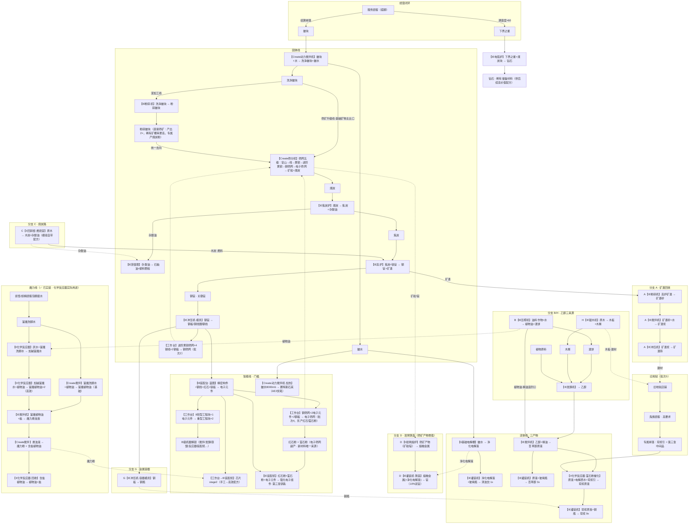

# 11 · 第二章总体流程图（机器标注版）

> 汇总 07–10 的当前设计为**一张总流程图**（主线 + 6 条分支汇入 + 已实装魔力线）。更新时间：2026-08-30（深加工线简化：粉碎机直出粉碎皴块直接筛矿，车窑不启用）。
> **节点格式：【机器】输入 → 产出**；分支节点带字母前缀（A–H，无 E/F）。任务节点提取表见文末。
> 图例：✅ = 已实装；⚠️ = 设计已定、尚未实现；无标记 = 纯设计。

## 总体流程图

## 汇入点一览（分支 → 主线节点）

| 分支 | 汇入的主线节点 | 汇入物 |
| --- | --- | --- |
| A 矿渣回收 | 旧地狱店铺（建材） | 矿渣砖 |
| B 植物油路 | 搅拌机（百草醇）/发酵机 | 植物油（精油溶剂②）/ 渣饼→乙醇 |
| C 烧炭路 | 高炉（燃料）/ 蒸馏塔 | 木炭 + 杂酚油 |
| D 坩埚铸造 | Create 筛分机（筛矿产物增值） | 铸造锭（+净化电解液 10% 双锭） |
| G 金属容器 | 琼浆灌装 | 钢瓶 |
| H 木屑乙醇 | 发酵机 | 木屑→乙醇 |

## 任务节点提取表（对着写任务书）

> 依赖 = 任务前置；机器栏可直接作为任务描述的上下文。
> 批次对应 07 文档；★ 为关键里程碑节点（建议用 gear 图标）。

| # | 任务节点建议 | 机器 | 产出（任务物品） | 依赖 | 批次 |
| --- | --- | --- | --- | --- | --- |
| 1 | 水洗净化（已有） | Create 动力搅拌机 | 洗净皴块 + 皴水 | 第一章毕业 | 1 |
| 2 | 黑金之源（已有） | IE 焦炭炉 | 焦炭 + 杂酚油 | 1 | 1 |
| 3 | 淬火成钢（已有）★ | IE 高炉 | 钢锭 | 2 | 1 |
| 4 | 板材初成 | IE 冲压机 | 钢板/钢线圈 | 3 | 2 |
| 4b | 钢网再织 | 工作台 | 钢筛网（筛矿产量 3×） | 4 | 2 |
| 5 | 星熔钻石 | IE 电弧炉 | 钻石 | 3（+下界之星） | 2 |
| 6 | 浊水成饮 | II 基础电解槽 | 净化电解液 | 1 | 2 |
| 7 | 清浊入瓶 | IE 灌装机 | 清浊饮 | 6+4 | 2 |
| 8 | 发酵之道 | IE 发酵机 | 乙醇 | 4 | 3 |
| 9 | 百草成醇 | IE 搅拌机 | 百草醇原液 | 8 | 3 |
| 10 | 醇装入瓶 | IE 灌装机 | 百草醇 | 9+7 | 3 |
| 11 | 精控之芯（已有）★ | IE 装配台 | 电子元件 | 4 | 4 |
| 11b | 芯织天网 | 工作台 | 电子筛网（4×+红石/萤石粉） | 11+4b | 4 |
| 12 | 重载之基 | 工作台 | 重型工程块 | 11 | 4 |
| 13 | 粉碎重塑 | IE 粉碎机 | 粉碎皴块 | 12（B 级） | 4 |
| 14 | 皴碎开筛 ★ | Create 筛分机 | 矿粒（产出 2×）+ 煤炭粉（专属） | 13 | 4 |
| 15 | 分馏之塔 | IE 蒸馏塔 | 石脑油+塑料颗粒 | 2（杂酚油） | 4–6 |
| 16 | 芯片迭代 | IE 装配机 | 芯片 stage2（高效版） | 11+12 | 4 |
| 17 | 旧地狱开业 ★ | —（维度/建筑） | 店铺启用 | 10+11 | 5 |
| 18 | 鬼族迎客 | —（顾客系统） | 首次服务鬼族 | 17 | 5 |
| 19 | 琼浆玉液 ★ | II 化学反应器 | 琼浆 | 18（琼浆引）+12（重型块→B级） | 5–6 |
| 20 | 毕业钥匙 ★ | IE 装配机 | 强化电子组件 | 14+11 | 6 |

**分支任务（可选支线，建议用方块小图标）**：

| 分支 | 任务节点建议 | 机器 | 依赖 |
| --- | --- | --- | --- |
| A | 变废为砖 | 粉碎机→搅拌机→冲压机 | 3 |
| B | 榨油有道 | IE 压榨机 | 4 |
| C | 炭火余温 | II 回转窑 + 燃烧室 | 4 |
| D | 熔融铸造 | II 坩埚熔炉 + 灌装机 | 4b（筛矿产物可用） |
| G | 钢铸容器 | IE 冲压机·容器模具 | 4 |
| H | 木屑酿酒 | IE 锯木机 | 8 |

## 落地状态核对（2026-08-30，与代码/任务书对照）

| 状态 | 内容 |
| --- | --- |
| ✅ 已实装 | 水洗/筛网/炼钢/钢线圈/赛特斯石英/电子元件（批次 1）；魔力线全链（富魔洗脚水→魔力粉，含 3 条化学反应器配方与任务章 3982F16B48EBC9C6） |
| ⚠️ 设计未实现 | 重型工程块改造（#12）、粉碎皴块直筛线（#13/#14）、钢/电子筛网（#4b/#11b）、本表其余任务节点 |
| ✅ 已定稿 | 化学反应器保留（魔力线+琼浆）；钻石块结构门槛作废（仅为魔改测试）；基础矿物主出口 = 筛矿升级线；三选一与电弧精炼分支删除，坩埚铸造改为筛矿产物增值路线；气体线（分支 E/可燃气体/气罐/粗制氨水）搁置，待第三章再设计；窑线演进：回转窑只吃纯物品输入（实测）归分支 C 烧炭，原「皴粉→车窑→矿砂」方案取消，深加工线简化为粉碎机直出粉碎皴块直接筛矿（产出 2×），车窑本章不启用，蒸馏塔直接分馏杂酚油、不注册焦油，新材料收敛到电子筛网 |

## 阅读说明

- **主线最短路径**（13 节点）：搓脚→水洗→筛网→焦炭→炼钢→冲压→装配台→重型块→粉碎（粉碎皴块）→筛网（电子筛网）→装配机→强化电子组件。
- **基础矿物出口唯一：筛矿机**（筛网五级阶梯：钢筛网/电子筛网由本章产物升级）；
  粉碎皴块也进同一筛分机（产出 2×，稀有矿概率更高，专属产煤炭粉），深加工线仅粉碎一步；
  新材料（红石粉/萤石粉）唯一来源 = 电子筛网副产。
- **魔力线已实装**，不在任务表编号内（已有独立任务章）；其化学配方是化学反应器的实际首用。
- **机器归属**：Create 3 环节（水洗/加热析出/筛分），IE 12 台，II 4 台（回转窑/坩埚/基础电解/化学反应器）+ 燃烧室（车窑本章不启用）。
- **写任务书用法**：# 列 + 依赖列即任务 DAG；机器栏写进任务描述，产出栏作为任务提交物；分支任务不挂主线依赖，只挂其「依赖」列节点。
